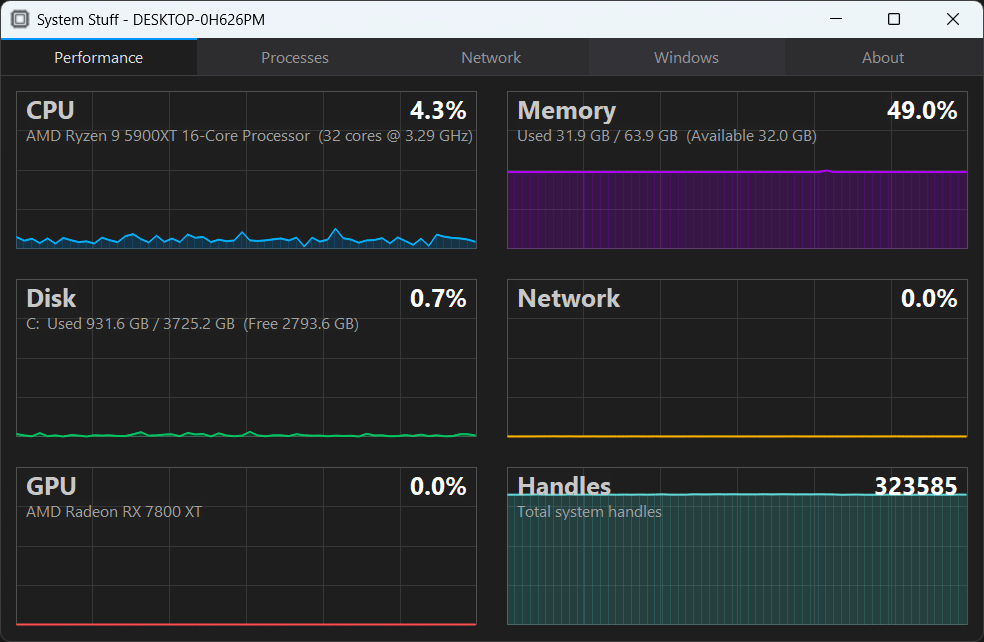

# System Stuff

A lightweight Windows system information utility built with the Win32 SDK. Uses 10% of the memory task manager uses.

Way back around 2000, the company I worked for still supported Windows 95 and 98 for the desktop application we sold. I typically volunteered to test on those platforms and had written my own task manager like program. Every 5 years or so I get it building and do a few updates. Originally called sys-mate now called more generically sys-stuff. 



## Features

### Performance
- Real-time charts for CPU, Memory, Disk, Network, GPU, and Handle counts
- 60-sample scrolling history updated every second
- Anti-aliased line rendering with filled area graphs
- Responsive grid layout (2 columns wide, 1 column narrow)

### Processes
- Process list with name, PID, and working-set memory (Toolhelp32)
- Module list for the selected process showing path and size
- Filter-as-you-type search
- Context menu to show in Explorer or kill a process

### Network
- Active TCP and UDP connections (IP Helper API)
- Protocol, local/remote address, state, and owning PID

### Windows
- Enumeration of visible top-level windows with title, class, PID, and handle
- Detail pane showing rect, style, and extended style for the selected window
- Filter-as-you-type search
- Close window or open owning process in Explorer

## Building

Requires Visual Studio 2022 17.14+ (v145 toolset) or Visual Studio 2026.

```
msbuild src\sys-stuff.vcxproj /p:Configuration=Release /p:Platform=x64
```

Or open `sys-stuff.sln` in Visual Studio.

## License

Copyright (c) 2002+ Zac Walker
